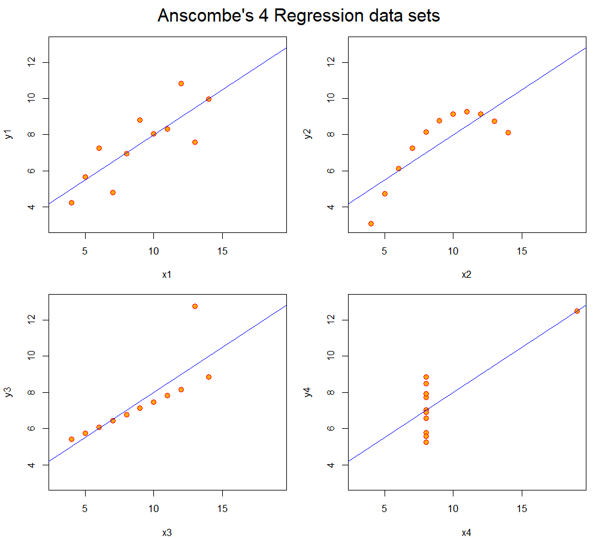
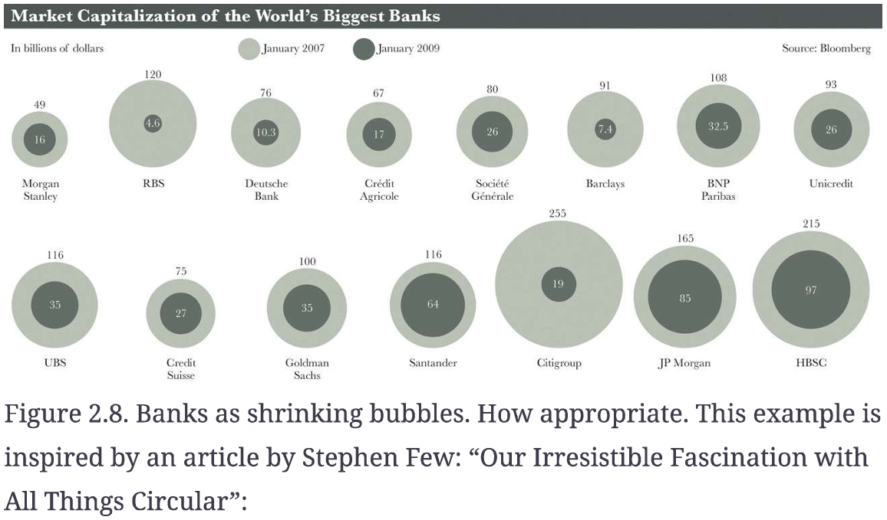

## 1. Anscombe's Quartet

Anscombe's quartet (Anscombe 1973) shows that summary statistics can oversimplify data. The four data sets share nearly identical statistical properties: the mean of x is 9, the mean of y is 7.5, the correlation is 0.816, and every fitted regression line is y = 3 + 0.5x with an R² of 0.67. Because these numbers are only summaries, they suggest the four data sets are the same. The scatter plots, however, reveal four different structures: data set 1 is roughly linear, data set 2 is clearly curved, data set 3 is a near-perfect line distorted by one outlier, and in data set 4 a single extreme point creates the entire slope. A linear regression is only appropriate for the first case. Anscombe's own solution is to make both calculations and graphs: scatterplot the data before any regression, plot the residuals against the fitted values after fitting, transform the variables or add a quadratic term when the relation is curved (data set 2), check whether outliers are recording errors (data set 3), and when one observation strongly influences the result, report the regression both with and without it (data set 4).

## 2. Fall.R — Winter Colors

I modified `Fall.R` to use a winter palette: light steel blue branches (`lightsteelblue1`) on a (`midnightblue`) background.

{width="60%"}

## 3. Chart Critique

This chart uses nested bubbles to compare the market value of 15 banks in January 2007 and January 2009. The problem is that people judge length much more accurately than area. For example, Société Générale's value fell from \$80 billion to \$26 billion, but it is hard to tell from the bubbles that the inner circle is only about one-third of the outer one. As Cairo shows, a bar chart makes this comparison much easier. Bubble charts are popular and look attractive, but designers often choose them by following trends rather than asking what the reader needs to see.

I would go one step further. The real story in this data is how much each bank lost, yet neither the bubble chart nor a simple bar chart shows the percentage decline directly. RBS lost 96% of its value, Citigroup 93%, and Barclays 92%, while Santander lost only 45%. These differences are almost invisible in the bubbles. A bar chart of percentage change, sorted from largest to smallest loss, or a dumbbell chart connecting the 2007 and 2009 values, would let readers see immediately which banks were hit hardest by the financial crisis.

## References

Anscombe, Francis J. 1973. "Graphs in Statistical Analysis." *The American Statistician* 27(1): 17–21.

Cairo, Alberto. 2012. *The Functional Art: An Introduction to Information Graphics and Visualization*. Berkeley, CA: New Riders.

## AI Use Statement

I used Claude (Anthropic) to guide me through running the R scripts, exporting the figures, and adding this page to my Quarto website. The analysis ideas in Sections 1 and 3 are my own; Claude helped translate and polish my English, suggested the specific solutions in Section 1, and calculated the percentage declines in Section 3. I used AI to save time and to clarify my writing in English.

The full AI conversation log is available here: [AI Use Log](ai-log.qmd).
