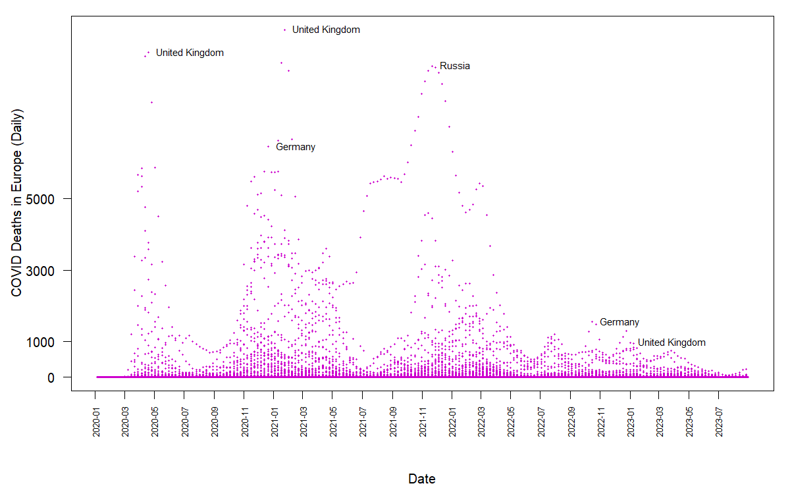

Taking base R charts apart, rebuilding them by hand, then doing the same job in ggplot2 — and replicating one published chart.

## 1. Documenting a chart

I chose the scatterplot panel from `examples-stdplots.R` in chapter 1 of Murrell's *R Graphics*, because it is the only one of the six that never calls a high-level function. It builds the whole figure from `plot.new()` and `plot.window()` plus low-level calls, which makes every ingredient of a plot visible. The comment on each call says what that call contributes to the finished figure.

```{r}
#| label: fig-documented
#| fig-cap: "The scatterplot panel from Murrell's chapter 1, with a comment per call."
#| fig-alt: "Two series plotted against travel time, with a left and a right vertical axis and a three-sided frame."
x  <- c(0.5, 2, 4, 8, 12, 16)       # travel time in seconds: the x positions
y1 <- c(1, 1.3, 1.9, 3.4, 3.9, 4.8) # responses per travel: the rising series
y2 <- c(4, .8, .5, .45, .4, .3)     # responses per second: the falling series

op <- par(las = 1,                  # tick labels horizontal, so the right axis reads easily
          mar = c(4, 4, 2, 4),      # extra space on the RIGHT for the second y axis
          cex = .7)                 # shrink all text so the panel is not crowded

plot.new()                          # opens an empty plot region; draws nothing at all
plot.window(range(x), c(0, 6))      # fixes the coordinate system: x from the data, y from 0 to 6

lines(x, y1)                        # the line carries the trend between the six
lines(x, y2)                        # discrete observations, which points alone cannot show
points(x, y1, pch = 16, cex = 2)    # solid circles: the rising series
points(x, y2, pch = 21, bg = "white", cex = 2)
                                    # open circles drawn over the line, so each marker hides
                                    # the line behind it and the two series stay separable

par(col = "gray50", fg = "gray50", col.axis = "gray50")
                                    # everything from here on is grey, so the frame recedes
                                    # and the black data stays dominant

axis(1, at = seq(0, 16, 4))         # bottom axis; ticks chosen by hand, not by R's default
axis(2, at = seq(0, 6, 2))          # left axis, read against "responses per travel"
axis(4, at = seq(0, 6, 2))          # the two series share a numeric range but measure
                                    # different quantities, so each gets its own labelled axis
box(bty = "u")                      # frame on three sides only; the top stays open

mtext("Travel Time (s)", side = 1, line = 2, cex = 0.8)
mtext("Responses per Travel", side = 2, line = 2, las = 0, cex = 0.8)
                                    # las = 0 turns this label vertical, parallel to its axis
mtext("Responses per Second", side = 4, line = 2, las = 0, cex = 0.8)
text(4, 5, "Bird 131")              # text() places a string INSIDE the plot region at data
                                    # coordinates; mtext() places strings in the margins
par(op)                             # restores the settings so the next figure starts clean
```

## 2. Anscombe's quartet

### Comparing the regression models

```{r}
#| label: tbl-fits
data(anscombe)

fits <- lapply(1:4, function(i)
  lm(anscombe[[paste0("y", i)]] ~ anscombe[[paste0("x", i)]]))

compare <- data.frame(
  dataset   = 1:4,
  intercept = sapply(fits, function(m) round(coef(m)[1], 3)),
  slope     = sapply(fits, function(m) round(coef(m)[2], 3)),
  r_squared = sapply(fits, function(m) round(summary(m)$r.squared, 4)),
  resid_se  = sapply(fits, function(m) round(summary(m)$sigma, 4)),
  row.names = NULL
)
knitr::kable(compare, caption = "All four fits agree to three decimal places.")
```

```{r}
#| label: tbl-basics
basics <- data.frame(
  dataset = 1:4,
  mean_x  = sapply(1:4, function(i) mean(anscombe[[paste0("x", i)]])),
  var_x   = sapply(1:4, function(i) round(var(anscombe[[paste0("x", i)]]), 3)),
  mean_y  = sapply(1:4, function(i) round(mean(anscombe[[paste0("y", i)]]), 3)),
  var_y   = sapply(1:4, function(i) round(var(anscombe[[paste0("y", i)]]), 3)),
  corr    = sapply(1:4, function(i) round(cor(anscombe[[paste0("x", i)]],
                                              anscombe[[paste0("y", i)]]), 3))
)
knitr::kable(basics, caption = "The summary statistics agree as well.")
```

### Comparing ways of drawing them

```{r}
#| label: fig-quartet
#| fig-cap: "The same four fits, drawn with a different colour, line type and plotting character each."
#| fig-alt: "Four scatterplots in a two by two grid, each with the same fitted line but a different pattern of points."
#| fig-height: 6
cols <- c("#0072B2", "#D55E00", "#009E73", "#CC79A7")   # colour-blind safe
ltys <- c(1, 2, 3, 4)
pchs <- c(16, 17, 15, 18)

op <- par(mfrow = c(2, 2), mar = c(4, 4, 2, 1), las = 1)
for (i in 1:4) {
  xi <- anscombe[[paste0("x", i)]]
  yi <- anscombe[[paste0("y", i)]]
  plot(xi, yi, xlim = c(3, 20), ylim = c(3, 13),
       pch = pchs[i], col = cols[i], cex = 1.4,
       xlab = paste0("x", i), ylab = paste0("y", i),
       main = paste("Data set", i))
  abline(fits[[i]], col = cols[i], lty = ltys[i], lwd = 2)
}
par(op)
```

The two tables above show that all four data sets share the same intercept (3.00), slope (0.50), R² (0.6665) and almost identical residual standard errors, alongside means, variances and correlations that agree to two decimal places. Judged by these numbers alone, they appear to be the same data set repeated four times. The scatterplots show otherwise. Data set 1 is the roughly linear relationship the statistics imply, while data set 2 follows a smooth curve that a straight line cannot represent. Data set 3 is an almost perfect linear relationship whose fitted line is dragged away from it by a single outlier, and in data set 4 the slope is an artifact: every x is 8 except one observation at 19, so that one point alone determines the line. Summary statistics can quantify the magnitude of a relationship, but they are blind to its shape and highly vulnerable to the leverage of isolated points. The remedy is to make graphing part of the modelling process rather than a postscript: plot the raw data before fitting anything, examine the residuals against the fitted values afterwards, and transform a variable or add a quadratic term when the pattern turns out to be curved. When a single observation dictates the result, the most transparent approach is to report the model both with and without it, so the reader can see how much the conclusion rests on that one point.

## 3. Finetuning without leaving base R

Three changes, base graphics only: a serif font, a palette of my own, and my own plotting character. `pch` accepts a literal character, so the marker is a glyph I chose rather than one of R's 25 numbered symbols.

```{r}
#| label: fig-tuned-base
#| fig-cap: "Anscombe data set 1 tuned in base R: serif type, a four-colour palette, and a glyph as the plotting character."
#| fig-alt: "Scatterplot on a warm off-white panel with dark diamond-star markers and a brick red fitted line."
ink    <- "#2F3E46"; accent <- "#A63A2E"
panel  <- "#FBF7F0"; grid   <- "#CBD5D1"
fit1 <- lm(y1 ~ x1, data = anscombe)

op <- par(family = "serif", bg = panel, fg = ink,
          col.axis = ink, col.lab = ink, col.main = ink,
          mar = c(4.5, 4.5, 3, 1.5), las = 1)

plot(anscombe$x1, anscombe$y1, type = "n",
     xlim = c(3, 20), ylim = c(3, 13),
     xlab = "x1", ylab = "y1",
     main = "Anscombe data set 1, tuned in base R", bty = "n")
abline(h = seq(4, 12, 2), col = grid, lwd = 0.8)
abline(v = seq(4, 20, 4), col = grid, lwd = 0.8)
abline(fit1, col = accent, lwd = 2)
points(anscombe$x1, anscombe$y1, pch = "✦", col = ink, cex = 1.3)
box(bty = "l", col = ink)
mtext("Fitted line: y = 3.00 + 0.50x", side = 3, line = 0.2,
      adj = 0, cex = 0.8, col = accent)
par(op)
```

## 4. The same chart in ggplot2

```{r}
#| label: fig-tuned-ggplot
#| fig-cap: "The same chart rebuilt in ggplot2. Note that the fitted line stops at the data."
#| fig-alt: "The same scatterplot drawn with ggplot2, with the regression line spanning only the range of the observations."
#| message: false
#| warning: false
library(ggplot2)

ggplot(anscombe, aes(x1, y1)) +
  geom_smooth(method = "lm", se = FALSE, colour = accent, linewidth = 0.9) +
  geom_point(shape = "✦", colour = ink, size = 4) +
  scale_x_continuous(limits = c(3, 20), breaks = seq(4, 20, 4)) +
  scale_y_continuous(limits = c(3, 13), breaks = seq(4, 12, 2)) +
  labs(title = "Anscombe data set 1, tuned in ggplot2",
       subtitle = "Fitted line: y = 3.00 + 0.50x", x = "x1", y = "y1") +
  theme_minimal(base_family = "serif", base_size = 12) +
  theme(
    plot.background  = element_rect(fill = panel, colour = NA),
    panel.background = element_rect(fill = panel, colour = NA),
    panel.grid.major = element_line(colour = grid, linewidth = 0.3),
    panel.grid.minor = element_blank(),
    axis.line.x = element_line(colour = ink),
    axis.line.y = element_line(colour = ink),
    axis.text   = element_text(colour = ink),
    axis.title  = element_text(colour = ink),
    plot.title    = element_text(colour = ink),
    plot.subtitle = element_text(colour = accent),
    plot.margin = margin(10, 8, 10, 10)
  )
```

### Which base-R setting became what

| base R | ggplot2 | kind |
|----|----|----|
| `par(family = "serif")` | `theme_minimal(base_family =)` | `theme()` |
| `par(bg =)` | `theme(plot.background =)` | `theme()` |
| `par(fg =, col.axis =, col.lab =)` | `theme(axis.text =, axis.title =)` | `theme()` |
| `par(mar =)` | `theme(plot.margin = margin())` | `theme()` |
| `par(las = 1)` | default; `theme(axis.text.y = element_text(angle = 0))` | `theme()` |
| `box(bty = "l")` | `theme(axis.line.x =, axis.line.y =)` | `theme()` |
| `abline(h =, v =, col = grid)` | `theme(panel.grid.major =)` | `theme()` |
| `xlim`, `ylim` in `plot()` | `scale_*_continuous(limits =)` | `scale_*()` |
| `axis(at = seq(...))` | `scale_*_continuous(breaks =)` | `scale_*()` |
| `col =` in `points()` | `colour =` in `geom_point()` | aesthetic |
| `pch = "✦"` | `shape = "✦"` | aesthetic |
| `abline(fit1)` | `geom_smooth(method = "lm")` | geom |

**No equivalent, or works differently**

- `par(mfrow = c(2, 2))`: ggplot2 has no device-level layout. The nearest equivalents are `facet_wrap()` for the same plot over different subsets, or an external package such as patchwork for different plots side by side.
- `op <- par(...)` and `par(op)`: there is nothing to restore. A ggplot carries its own theme, so settings never leak into the next figure.
- Drawing order: in base R the order of the calls *is* the z-order; in ggplot2 the order of the layers in the `+` chain does that job, and the whole plot is assembled before anything is drawn.

In base R, `abline()` draws an unbounded line across the plot region, because it represents the fitted equation rather than the fitted values. In ggplot2, `geom_smooth()` is a layer computed over the range of the data, so the line stops at the first and last observation unless `fullrange = TRUE` is set. The two figures therefore encode the same model but make different claims about where that model applies.

## 5. Replicating the COVID chart

Daily COVID deaths in Europe, one point per country per day, from the Our World in Data frozen snapshot. The file is about 94 MB, so it is not kept in this repository; the code below downloads it once and works from the local copy.

```{r}
#| eval: false
# Daily COVID counts, Our World in Data (frozen snapshot).
url <- paste0("https://raw.githubusercontent.com/owid/covid-19-data/",
              "master/public/data/owid-covid-data.csv")
download.file(url, "owid-covid-data.csv", mode = "wb")
owidall <- read.csv("owid-covid-data.csv")

owidall <- owidall[!grepl("^OWID", owidall$iso_code), ]   # drop aggregate rows
owideu  <- subset(owidall, continent == "Europe")

owideu$date <- as.Date(owideu$date)
d <- owideu[!is.na(owideu$new_deaths), c("location", "date", "new_deaths")]
d <- d[d$new_deaths >= 0, ]                               # a few negative corrections exist
d <- d[d$date <= as.Date("2023-08-31"), ]                 # the window shown in the target

# The labels are not a legend: take the highest points in each six-month window,
# then drop any country already labelled within the previous four months, so one
# bad spike does not claim every label.
chunks <- split(d, cut(d$date, breaks = "6 months"))
cands  <- do.call(rbind, lapply(chunks, function(ch)
  if (nrow(ch)) ch[order(-ch$new_deaths), ][1:3, ] else NULL))
cands  <- cands[!is.na(cands$location), ]
cands  <- cands[order(-cands$new_deaths), ]

lab <- cands[0, ]
for (i in seq_len(nrow(cands))) {
  same <- lab$location == cands$location[i] &
          abs(as.numeric(lab$date - cands$date[i])) < 120
  if (!any(same)) lab <- rbind(lab, cands[i, ])
}
lab <- head(lab[order(-lab$new_deaths), ], 6)

draw_chart <- function() {
  op <- par(mar = c(6.5, 4.5, 1, 1), las = 1)
  plot(d$date, d$new_deaths, pch = 20, cex = 0.45,
       col = "magenta3",                       # the single non-default colour
       axes = FALSE, xlab = "", ylab = "")
  axis(2, at = c(0, 1000, 3000, 5000))
  mtext("COVID Deaths in Europe (Daily)", side = 2, line = 3, las = 0)
  ticks <- seq(as.Date("2020-01-01"), max(d$date), by = "2 months")
  axis(1, at = ticks, labels = format(ticks, "%Y-%m"), las = 2, cex.axis = 0.65)
  mtext("Date", side = 1, line = 5)
  box()
  text(lab$date, lab$new_deaths, labels = lab$location, pos = 4, cex = 0.75, xpd = NA)
  par(op)
}

draw_chart()                                   # preview
png("covid-europe.png", width = 1200, height = 750, res = 120)
draw_chart()                                   # same function, so the export matches the preview
dev.off()
```



Three notes on the replication. The labels are placed with `text()` at the data coordinates of the points themselves, not with `legend()` — a legend would map colours to countries, which is not what the target does. The date axis is drawn by hand with `axis()` so the ticks fall every two months and `las = 2` turns the labels upright. Wrapping the plotting code in a function means the preview and the exported PNG are produced by the same code, so the file cannot drift from what I checked on screen.

## References

Murrell, Paul. 2019. *R Graphics*. Third edition. Boca Raton: Chapman & Hall/CRC.

Anscombe, Francis J. 1973. "Graphs in Statistical Analysis." *The American Statistician* 27(1): 17–21.

Our World in Data. *COVID-19 Dataset*. <https://github.com/owid/covid-19-data>

## AI Use Statement

I used Claude (Anthropic) in the Claude desktop app to plan this assignment, to scaffold the five R scripts, to check my answers, and to assemble this page. The choice of chart to document, the colours and the plotting character, the reading of the four Anscombe fits, and the comparison of the base R and ggplot2 figures are mine; Claude supplied the structure, the label-selection rule for the COVID chart, and corrections to my English.
