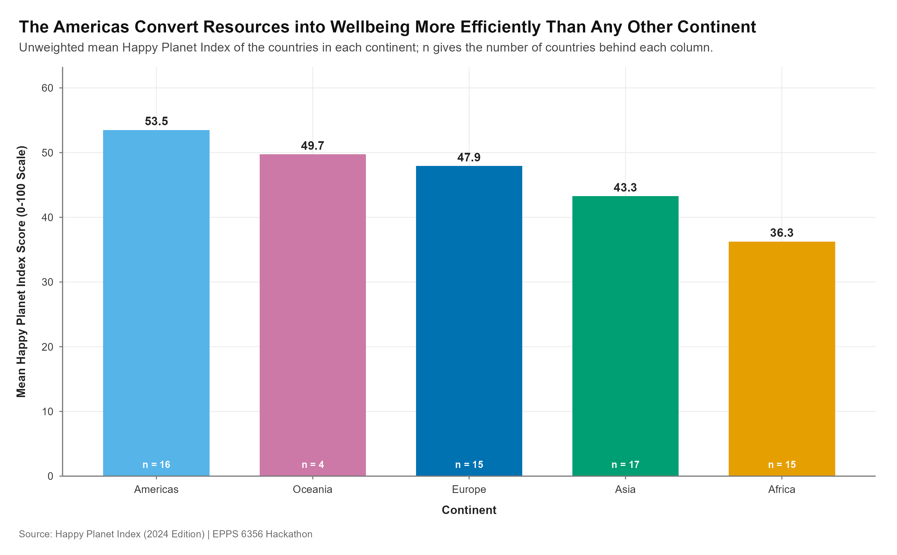

Assignment 4 was a team deliverable. Our group's portfolio site holds the finished
product; this page records the part I built and how it was made.

- **Team repository:** [nedretsencavus/portfolio](https://github.com/nedretsencavus/portfolio)
- **My contribution:** Chart 4, the shared theme file `R/theme.R`, and the
  reproducibility paperwork (`README.md`, `prompts.md`, `sessionInfo.txt`)
- **Data:** Happy Planet Index, 2024 edition (153 countries)

## Chart 4: one variable across a few items

Abela's Chart Thought-Starter sends a comparison of *one variable among a few
items* to a column chart, so that is what the brief called for. The variable is
the Happy Planet Index; the items are the five continents.

{fig-alt="Column chart of mean Happy Planet Index by continent. The Americas lead, followed by Asia, Europe, Oceania and Africa, with country counts printed inside each column."}

### The code

```{r}
#| eval: false
df_chart4 <- hpi_clean |>
  group_by(continent) |>
  summarise(mean_hpi = mean(hpi, na.rm = TRUE),
            n        = dplyr::n(),
            .groups  = "drop") |>
  mutate(continent_ordered = fct_reorder(continent, mean_hpi, .desc = TRUE))

p4 <- ggplot(df_chart4,
             aes(x = continent_ordered, y = mean_hpi, fill = continent)) +
  geom_col(width = 0.68, show.legend = FALSE) +
  geom_text(aes(label = sprintf("%.1f", mean_hpi)),
            vjust = -0.55, size = 3.6, fontface = "bold") +
  geom_text(aes(y = 1.8, label = paste0("n = ", n)),
            size = 2.9, colour = "#FFFFFF", fontface = "bold") +
  scale_fill_continent() +
  scale_y_continuous(name = "Mean Happy Planet Index Score (0-100 Scale)",
                     limits = c(0, 62), breaks = seq(0, 60, by = 10),
                     expand = expansion(mult = c(0, 0.02))) +
  theme_hackathon(legend_pos = "none")
```

The full script is
[`assignments/Chart4.R`](https://github.com/nedretsencavus/portfolio/blob/main/assignments/Chart4.R)
in the team repository.

### Three decisions behind the chart

**The bars start at zero and the axis says so.** A column encodes a quantity by
length, so a truncated baseline makes the lengths lie. `limits = c(0, 62)` with
`expand = expansion(mult = c(0, 0.02))` pins the columns to the axis line instead
of floating them above it.

**The columns are sorted, not alphabetical.** Alphabetical order would be a
second, irrelevant variable competing with the one the reader came for. Sorting
by the mean turns the ranking into something read at a glance, which is the
cheapest comparison in Cleveland and McGill's hierarchy — position along a common
scale.

**The chart states its own *n*.** A continental mean hides how many countries it
averages: Oceania's mean rests on a handful of countries, Africa's on dozens. The
white `n = ` label inside each column puts that caveat where the number is,
rather than in a footnote nobody reads.

## Beyond the chart

`Chart1.R` and `Chart3.R` both called `source("R/theme.R")`, but that file was not
in the repository — the palette and theme lived only inside a setup chunk in the
Quarto document, so the scripts could not be run on their own. I extracted the
Okabe–Ito palette, the three `scale_*` helpers and `theme_hackathon()` into
`R/theme.R`, which made every chart script reproducible from a clean clone and
gave Chart 4 the same visual language as the other three.

I also wrote the team `README.md` (reproduction steps, package list, repo layout,
data source) and `prompts.md`, the AI disclosure covering my prompts for Chart 4,
and generated `sessionInfo.txt`.

## AI use

My AI use for this assignment is disclosed in the team repository's
[`prompts.md`](https://github.com/nedretsencavus/portfolio/blob/main/prompts.md)
rather than duplicated here, so that the disclosure sits next to the code it
describes.

## Commits

My work is visible in the team repository's history:

| Commit | What it added |
|---|---|
| [`2587b84`](https://github.com/nedretsencavus/portfolio/commit/2587b847779d2cedf31e91260d525e1ce1737c5f) | Chart 4 and the extracted `R/theme.R` |
| [`07f074f`](https://github.com/nedretsencavus/portfolio/commit/07f074fb60669eda3c8bbb41ce5ca444fd6e55b6) | Rotated the Chart 4 y-axis title to match Chart 1 |
| [`bc0e230`](https://github.com/nedretsencavus/portfolio/commit/bc0e2309ebc0250c452cd17c88842ce437b58be9) | `README.md`, `prompts.md`, `sessionInfo.txt` |
