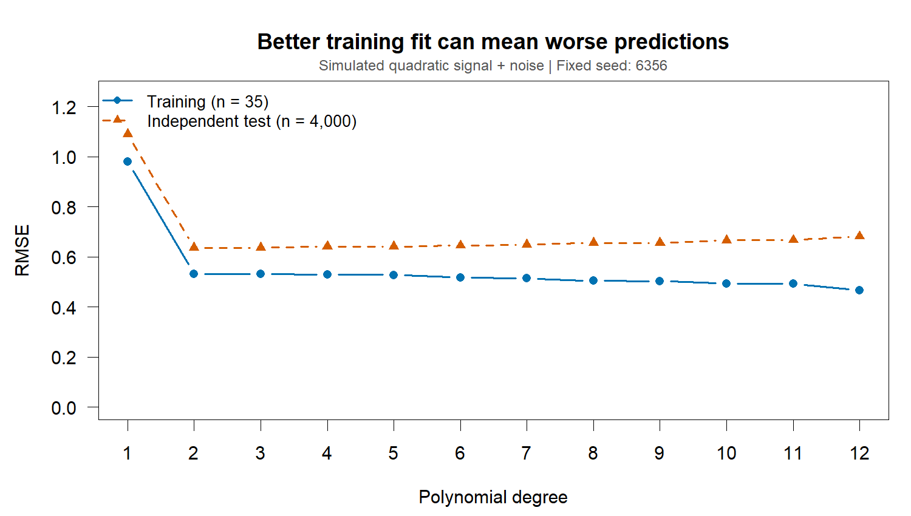

## a. Big data analytics pitfalls

Google Flu Trends (GFT) offered a compelling shortcut: estimate influenza-like illness from searches before conventional surveillance reports arrived. [Ginsberg et al. (2009)](https://doi.org/10.1038/nature07634) reported estimates with roughly a one-day lag. However, searches measure information-seeking, not infections, and the CDC target itself measures the proportion of visits involving influenza-like symptoms, not laboratory-confirmed influenza incidence.

**Big data hubris** means assuming that abundant digital traces can replace established measurement and analysis. [Lazer et al. (2014)](https://gking.harvard.edu/files/gking/files/0314policyforumff.pdf) reported that GFT overestimated the CDC measure in 100 of 108 weeks beginning in August 2011. More searches did not repair the mismatch between searching and being ill.

**Algorithm dynamics** make that mismatch unstable. Search suggestions and symptom-related results can change what people search for even without a corresponding change in illness. Lazer and colleagues identify these platform changes as plausible contributors, rather than proving one specific update caused the failure. Deliberate manipulation by users is another possible platform-data problem, although they do not identify it as a GFT explanation.

**Transparency and replicability** also matter: undisclosed search terms and incomplete methodological detail obstructed independent reconstruction. My takeaway is to preserve model versions, document data processing, and evaluate against external benchmarks. Search data can supplement surveillance, with repeated checks as behavior and platforms change.

## b. Overfitting and overparameterization

**Overfitting** occurs when a fitted procedure captures accidental features of its training sample and consequently generalizes poorly. **Overparameterization** describes a model with more adjustable parameters than the available observations can adequately constrain; in an interpolating regression setting, the parameter count can exceed the sample size. It concerns capacity, whereas overfitting concerns performance. Regularization and other constraints can prevent a highly parameterized model from generalizing badly.

GFT illustrates a related danger in feature selection. The original procedure screened about 50 million candidate queries against a limited CDC series and combined 45 selected queries into one predictor. Its final regression had an intercept and slope, not 50 million fitted coefficients ([Ginsberg et al., 2009](https://doi.org/10.1038/nature07634)). Counting only those two coefficients nevertheless misses the flexibility spent selecting the predictor. Lazer et al. describe 1,152 fitting observations and irrelevant seasonal candidates such as high-school basketball. Searching so widely creates opportunities to select coincidences.

This distinction changes how I would validate the analysis: repeat feature selection inside training folds, reserve later time periods for evaluation, and compare with simple seasonal baselines. A successful historical test cannot guarantee robustness to a changed search platform. Overfitting and a shifting data-generating process can coexist.

The R simulation below isolates overfitting using noisy quadratic data. Training error falls with polynomial degree, while error on independently generated test data can rise. These are simulated observations, not GFT estimates; the curve illustrates a mechanism rather than reconstructing Google's failure.

{fig-alt="Line chart comparing training and independent test RMSE across polynomial degrees 1 through 12. The training curve falls while the test curve rises at higher degrees."}

[Reproduce the chart with this base R script](scripts/assignment5-overfitting.R). Run it from the website project directory.

## c. Wickham talk summary

In his [2019 EMBL keynote](https://www.youtube.com/watch?v=9YTNYT1maa4), Wickham presents visualization as part of an iterative programming workflow. Technologies include R, RStudio, tidyverse tools, ggplot2, and R Markdown. Techniques include reshaping tidy data, mapping variables to aesthetics, layering plots, adjusting scales, handling overplotting, faceting, animation, and using functions to reduce repetition. His country income and life-expectancy example makes these choices concrete: colour and size add information, while a logarithmic income scale changes what differences are visible.

The larger point is that reusable components and readable code make exploration easier, while executable reports connect explanations to computations. Visualization and modeling can inform each other: a residual plot may reveal a pattern that a single error statistic conceals.

I would qualify the emphasis on programming: reproducible code can faithfully reproduce a flawed measurement. For example, a polished chart of campus flu-related searches could reflect an awareness campaign rather than an outbreak. Wickham's workflow helps expose analytical choices, but the GFT case shows why those choices still require substantive knowledge and independent validation.

---

*AI assistance: drafting, source checks, and chart code were assisted by Codex. See the [AI use record](ai-log-assignment5.qmd) for the prompt, model information, and verification limits.*
